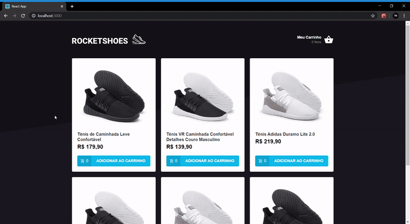

# Loja-de-Tenis-Frontend

Este projeto foi elaborado para servir a uma aplicação que simule uma loja de tênis estilo Netshoes. O projeto foi retirado de um Bootcamp, disponibilizado pela Rocketseat.

### Tecnologias Utilizadas
* React
* Redux
* Redux Saga
* Reactotron
* Polished
* Axios
* Immer
* Toastify
* Styled Components

### Introdução

Para testar a aplicação é necessário primeiramente realizar a instalação das dependências como o comando "yarn install". O projeto foi construido utilizando Yarn.

Para o projeto foi utilizado uma fake API, cuja função é simular um backend. Nela está contido os dados dos tênis. Para iniciar o servidor é necessário rodar o comando "json-server server.json -p 3333"

Para rodar a aplicação utiliza-se o comando "yarn start".

### Funcionalidades

#### Funções na página Home
##### 1. Adicionar ao carrinho
##### 2. Viajar para o carrinho

#### Funções na página Cart
##### 1. Remover item do carrinho
##### 2. Aumentar e diminuir a quantidade de um item
##### 3. Viajar para Home

Ao adicionar um item ao carrinho, automaticamente, através do Redux, essa informação será propagada pela aplicação, aumentando o número de itens no Header "Meu Carrinho".
Modificações realizadas no carrinho, como aumentar ou diminuir a quantidade de um item, também são propagadas no restante da aplicação.

Um exemplo de todas as ações da aplicação é mostrado no gif abaixo.

